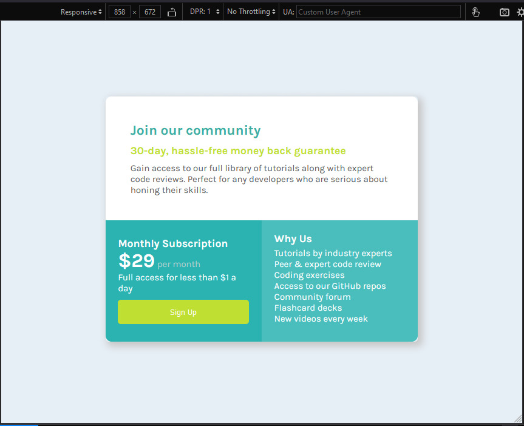

# Make It Real - Single price grid component

This is a solution to the fourth project of the Make It Real course.

## Table of contents

- [Make It Real - Single price grid component](#make-it-real---single-price-grid-component)
  - [Table of contents](#table-of-contents)
  - [Overview](#overview)
    - [The challenge](#the-challenge)
    - [Screenshot](#screenshot)
  - [My process](#my-process)
    - [Built with](#built-with)
    - [What I learned](#what-i-learned)
    - [Continued development](#continued-development)
    - [Useful resources](#useful-resources)
  - [Author](#author)
  - [Acknowledgments](#acknowledgments)

## Overview

### The challenge

In this challenge we have developed a pricing component and make it as similar to design as possible.

- Mobile design.
- Desktop design.

### Screenshot




## My process

### Built with

- Flexbox
- Grid
- Semantic HTML5 markup
- CSS custom properties
- Mobile-first workflow

### What I learned

We learned how to use Grid and Flexbox to desing renponsive layout.

We also used custom CSS to modify buttons and texts properties: e.g. colors, font-size, margin, paddings, etc.

Semantic HTML5

```html
<section class="Top__section">
  <div>
    <h2>Join our community</h2>

    <h3 id="top_subtitle">30-day, hassle-free money back guarantee</h3>
    <p id="top_text">
      Gain access to our full library of tutorials along with expert code
      reviews. Perfect for any developers who are serious about honing their
      skills.
    </p>
  </div>
</section>
```

Flexbox and Grid

```css
body {
  display: flex;
  justify-content: center;
  align-content: center;
  background-color: #e6eff6;
  color: #ffffff;
  font-size: 16px;
  font-family: "karla", sans-serif;
  width: 100vw;
  height: 100vh;
  font-size: 13px;
}

@media (min-width: 500px) {
  .section {
    display: grid;
    grid-template-columns: 1fr 1fr;
    grid-template-rows: 1fr 1fr;
    width: 60vw;
    height: 400px;
    max-width: none;
    height: 60vh;
    align-self: center;
    font-size: 15px;
  }
}
```

### Continued development

I will be nice to use another media query for shadow transition on medium size screens.

### Useful resources

- [Flexbox](https://css-tricks.com/snippets/css/a-guide-to-flexbox/) - very straigh foward sumary of flexbox properties.
- [Grid](https://www.youtube.com/watch?v=-kgGATnsPbs) - Useful Grid tutorial in YouTube (also in spanish).

## Author

- github - [Diana Bedoya](https://github.com/dianabedoya570)
- github - [Ivan Cabulo](https://github.com/icabulo)

## Acknowledgments

Nice help from out mentors. Sergio and Daniel.
